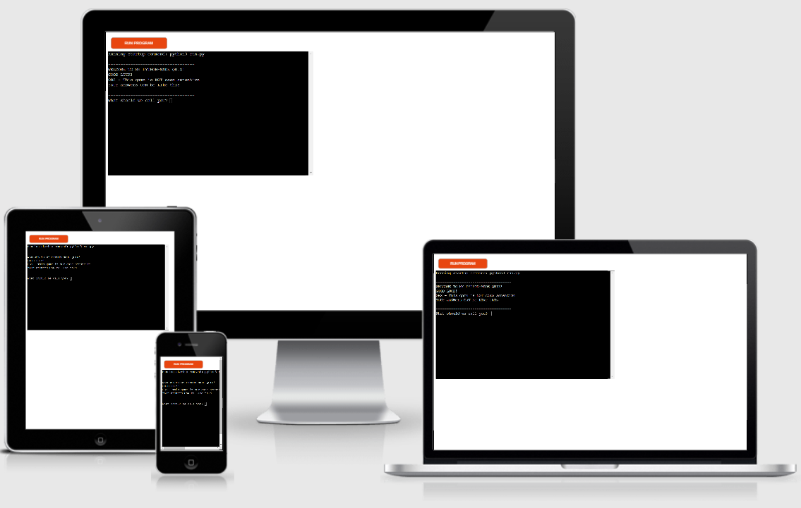
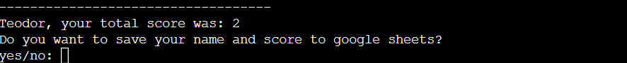

# Python-Made Quiz

This quiz is a Python terminal game that will run in the Code Institute mock terminal on Heroku.

Users will recieve one question at a time and earn 1 point per correct answer, just like a traditional quiz game.
[Play the game here](https://python-made-quiz.herokuapp.com/)

## How to play

This quiz game does not differ from the ones that you are familiar with.

In this game, the player will need to enter a name before continue to the questions.

The player will gain 1 point if the answer's correct.

The game will continue to the next question regardless if the answer's correct/incorrect.

There is a maximum of 5 points in this game.

## Features

### Existing Features
*   Name input validations

*   Save username and score to a google sheet

### Future Features
*   Add function to randomize questions
*   Add timer function so player have X seconds to answer

## Testing
I've tested this project by doing following:
*   Passing code through PEP8 and confirmed no errors
*   Give no input for name, save data to google sheets
*   Game works fine in both local and Code Institute Heroku terminal.

### Bugs
#### Solved bugs
*   When I first tried the live version with Heroku i got ModuleNotFoundError for gspread. I fixed that by add necessary text to requirements.txt file.

#### Remaining bugs
*   No unsolved bugs

#### Validator testing
*   PEP8
    *   No errors were found from [PEP8online](https://pep8online.com)

## Deployment
This project was deployed using Code Institute's mock terminal for Heroku.
*   Steps for deployment:
    *   Fork or clone this repository
    *   Create a new Heroku app
    *   Set the buildbacks to `Python` and `NodeJS` in that order
    *   Link the heroku app to the repository
    *   Click on **Deploy**

## Credits
*   Code Institute for deployment terminal